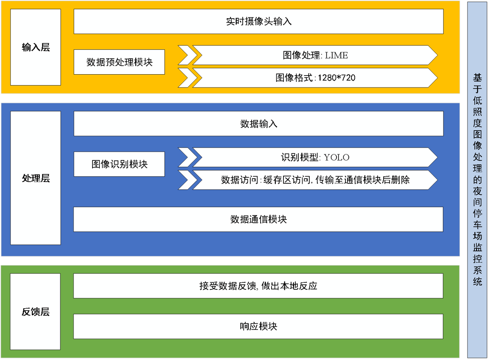
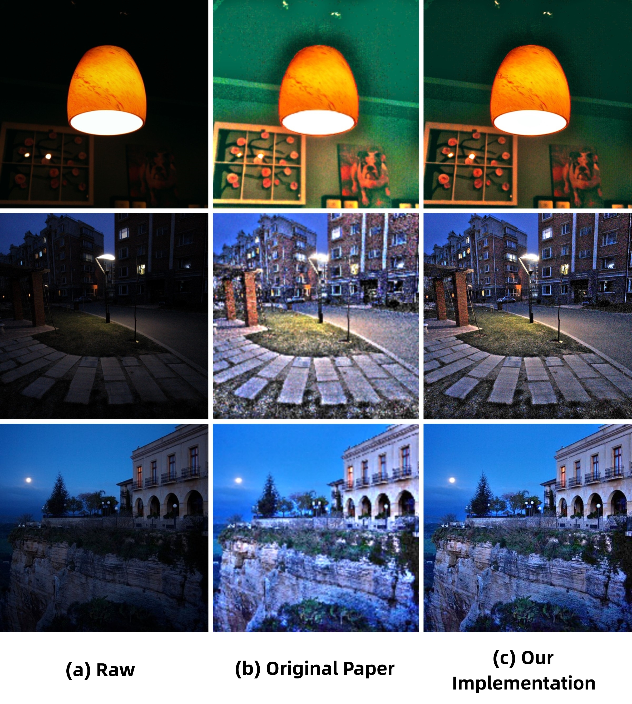

<h1><div align = "center"><font size="6"><b>DarkPG: Parking Guidance System in Low-Light Environment</b></font></div></h1>

## Background

**This** repository is an implementation of our proposed  DarkPG, a parking guidance system, which is suitable for low-light environments. DarkPG integrates the LIME algorithm, YOLOv8 and various parallel computing methods including MPI and NEON instructions. The speed performance of different models and parallel settings on the Phytium FT-2000/4 processor is demonstrated in Results.

## Architecture

The system has the architecture as following, which is divided into three layers. **The First Layer** is the **Input Layer**, which receives real-time input from a wide-angle camera and preprocesses it through **LIME** to enhance image and prepare for recognition. **The Second Layer** is the **Processing Layer**, and this layer mainly uses the optimized **YOLOv8** model to detect and recognize objects in the car park. **The Third Layer** is the **Feedback Layer**, whose function is to provide feedback to the parking lot guidance system based on the detection and recognition results. The guidance system intelligently finds the way through a series of algorithms.




## Results

- Processing Quality 

  The following is the comparison among **the raw pictures (a)**, **results provided by original paper (b)** and **results enhanced by our implementation (c)**. From it, we can see that our implementation of LIME has basically achieved the effect of the original paper. Further more, our implementation has lower noise and lower distortion rate as our strengths.

  

  Next, the following is the comparison of the results of **the raw pictures (a)** , **YOLOv8s (b),** **YOLOv8m (c)**, and **YOLOv8x(d)** in **high-light (I, II)** and **low-light (III, IV)**. Among them, I and III are the results of original YOLO, while II and IV are the results of Our System. 

  It can be seen that our system is at least on par with the original YOLO system in terms of quantity and accuracy of detection and recognition. In the case of high illumination (I, II), our system uses YOLOv8m for recognition with higher recognition rate and accuracy compared to the original YOLOv8m; In the case of low illumination (III, IV), our system uses YOLOv8x for recognition with higher recognition rate and accuracy compared to the original YOLOv8x.

  

- Processing Performance

  We used a low light picture with size of 1280 × 720 and low light video for performance testing, with a duration of 13 seconds and size of 1280 × 720, FPS 30, from Dataset LLIV-Phone. Please see `/samples` for more detail.

  First, we used four optimization methods according to the requirements of the competition, which are **Single Core**, **Single Core + Neon**, **Multi Core**, and **Multi Core+NEON**, and compared them . In addition, we used multiple FT-2000/4 processor to build a small cluster. Then we completed performance optimization between **Multi Devices** and compared them. As following, 

  |         | Single Core | Single Core + Neon | Multi Core | Multi Core + Neon | Multi Devices | Multi Devices + Neon |
  | :-----: | :---------: | :----------------: | :--------: | :---------------: | :-----------: | :------------------: |
  | Time/s  |   2066.36   |      483.986       | 562.001474 |    528.533603     |  237.516010   |      140.804475      |
  | Speedup |             |        4.26        |    3.67    |       3.91        |     8.72      |        14.67         |


## Requirements

Before running this project, please ensure that the device meets the following dependencies:

```shell
Cmake >= 3.12

OpenCV >= 4.7.0 

g++ >= 11

OPENMP

OPENMPI >= 4.1.5

FFTW >= 3.3.8
```


## Steps to run DarkPG

1. Build the project:

   ```
   cd DarkPM
   mkdir build 
   cd build 
   cmake ..
   make
   ```

2. Running on single device with single core:

   ```shell
   cd ../bin
   ./MAIN_ALONE ${video_name} [--neon]
   ```

3. Running on single device with Multi core:

   - To run a version without Neon, 

   ```shell
   cd ../bin
   mpirun -np ${CORE_NUMBER} ./MAIN_MPI
   ```

   - To run a version with Neon, 

   ```powershell
   cd ../bin
   mpirun -np ${CORE_NUMBER} ./MAIN_NEON_MPI
   ```

4. Running on cluster

   - Distribute the code to each node:

   - Write `hostfile` that specifies the number of processes for each node:

        ```shell
          ${USERNAME}@${IP} slots=6
          ...
        ```

   - Save `hostfile` in `bin`

   - Start running:

     - To run a version without Neon,
     
       ```shell
       cd ../bin
       mpiexec -np ${CORE_NUMBER} -hostfile hostfile --prefix ${OPENMPI_ADDRESS} ./MAIN_MPI
       ```
       
     - To run a version with Neon, 
     
       ```shell
       cd ../bin
       mpiexec -np ${CORE_NUMBER} -hostfile hostfile --prefix ${OPENMPI_ADDRESS} ./MAIN_NEON_MPI
       ```
       


## Cite

- **[LIME](https://ieeexplore.ieee.org/document/7782813/)**, X. Guo, Y. Li and H. Ling, "LIME: Low-Light Image Enhancement via Illumination Map Estimation," in IEEE Transactions on Image Processing, vol. 26, no. 2, pp. 982-993, Feb. 2017.
- **[YOLOv8](https://github.com/ultralytics/ultralytics)**
- [**PTVT**](https://europepmc.org/article/ppr/ppr658507), Sharma N, Baral S, Paing M P, et al. Parking Time Violation Tracking using Yolov8 and DeepSORT[J]. 2023.
- [**LLIV-Phone**](https://arxiv.org/abs/2104.10729), Li C ,  Guo C ,  Han L , et al. Low-Light Image and Video Enhancement Using Deep Learning: A Survey[J].  2021.

# Copyright
```
# Copyright      2023  (Zhengrui  Li, https://github.com/NASA1473,
#                       Haoyu     Wang, https://github.com/Yukijudaii1352)
#
# See ./LICENSE for clarification regarding multiple authors
#
# Licensed under the GNU GENERAL PUBLIC LICENSE (the "License");
# you may not use this file except in compliance with the License.
# You may obtain a copy of the License at
#
#     https://www.gnu.org/licenses/gpl-3.0.html
#
# Unless required by applicable law or agreed to in writing, software
# distributed under the License is distributed on an "AS IS" BASIS,
# WITHOUT WARRANTIES OR CONDITIONS OF ANY KIND, either express or implied.
# See the License for the specific language governing permissions and
# limitations under the License.
```